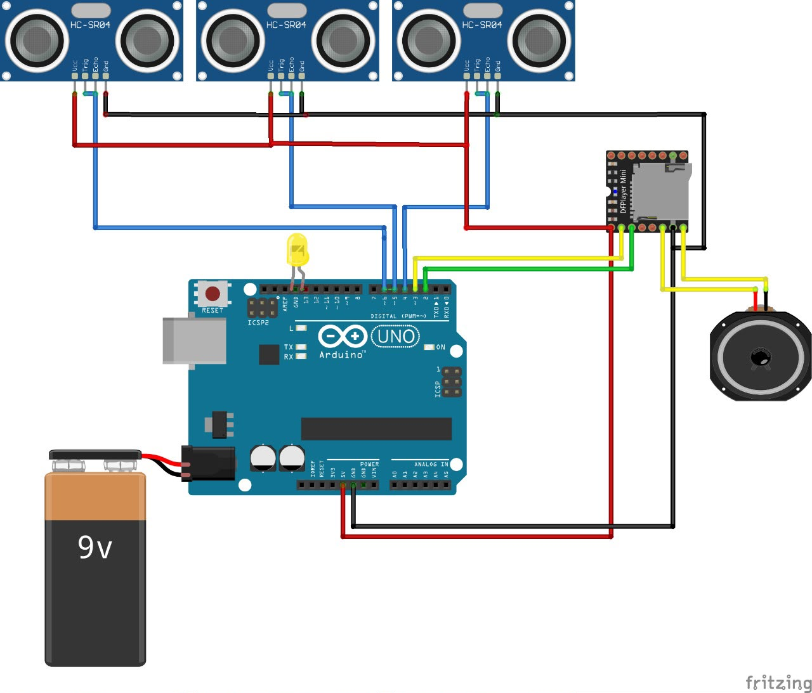
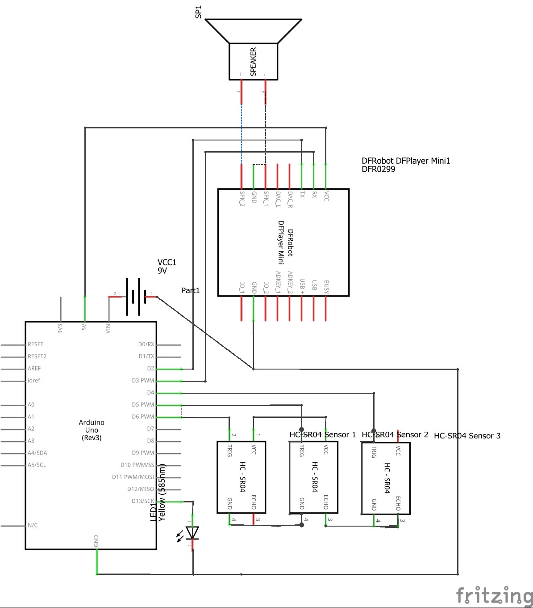

# Smart Walking Stick Using Arduino

An academic assistive-technology prototype designed to support safer navigation for visually impaired users and elderly individuals through real-time obstacle detection and direction-based audio feedback.

## Academic Context

- **Project type:** Diploma Project · Five-student academic team
- **Completion:** June 2024
- **Institution:** Middle East College, Oman
- **Supervisor:** Ms. Vimala Elumalai

## Problem

People with visual impairments and elderly users may face safety risks when navigating around nearby obstacles. This project explored an affordable embedded prototype that detects obstacles and gives immediate visual and audio feedback.

## Objective

To enhance mobility, safety, confidence, and independence by providing real-time obstacle detection and user feedback.

## My Contribution

I personally built, programmed, and tested the working prototype as part of the five-student academic team.

## System Overview

The prototype uses three ultrasonic sensors to monitor the user’s surroundings. When an obstacle enters the configured safety range, the Arduino Uno processes the sensor input, activates an LED indicator, and triggers direction-based audio feedback through a DFPlayer Mini and speaker.

## System Workflow

```text
Obstacle
→ Ultrasonic Sensor
→ Arduino Uno
→ LED Indicator
→ DFPlayer Mini
→ Audio Warning

```md
## Available Files

- `prototype_single_sensor.ino` — An early Arduino prototype demonstrating one ultrasonic sensor with LED and buzzer distance alerts.
- `images/system-wiring-overview.png` — Overall wiring layout for the documented three-sensor system with Arduino Uno, DFPlayer Mini, speaker, and 9V battery.
- `images/wiring-diagram-fritzing.png` — Detailed Fritzing schematic of the system wiring.

> **Note:** The available Arduino sketch documents an initial single-sensor prototype. The final hardware design shown in the wiring diagrams includes three ultrasonic sensors and direction-based audio through a DFPlayer Mini. The final integrated source code is not currently available in this repository.

## Circuit Diagrams

### Overall System Wiring



### Detailed Fritzing Schematic


